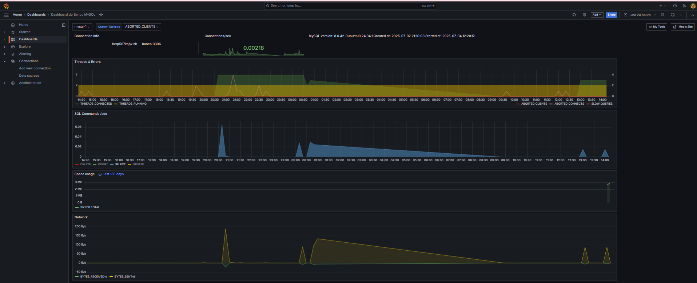
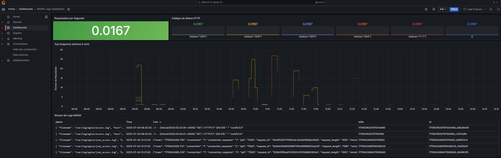
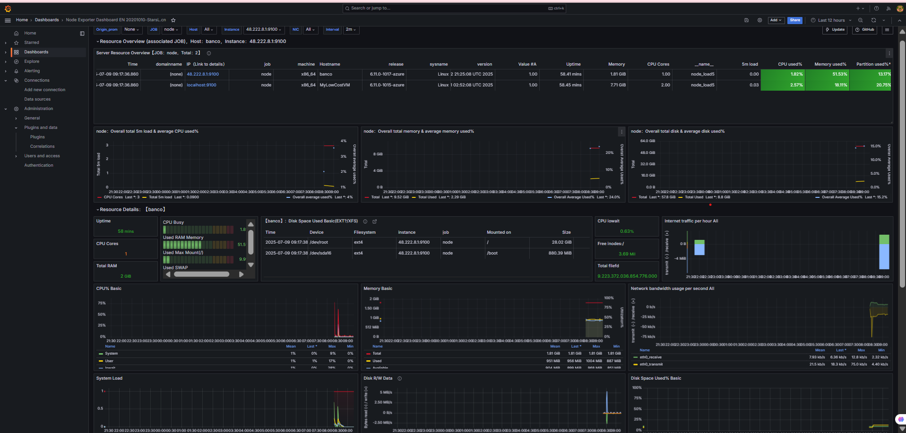

# 🚀 Observability Stack

Repositório dedicado à configuração da stack de observabilidade, contendo arquivos YAML para provisionamento, configuração e gerenciamento dos serviços necessários ao monitoramento de aplicações juntamente com os dashboards contruídos.

## 🛠️ Tecnologias e Ferramentas

* **[Loki](https://grafana.com/oss/loki/)** `v3.2.0`  
  Sistema de agregação e indexação de logs escalável e eficiente.

* **[Promtail](https://grafana.com/docs/loki/latest/clients/promtail/)** `v3.2.0`  
  Agente para coleta e envio de logs para o Loki.

* **[Grafana](https://grafana.com/)** `v11.2.0`  
  Painéis de visualização e análise de métricas e logs.

* **[Prometheus](https://prometheus.io/)** `v2.52.0`  
  Sistema de monitoramento e alerta baseado em séries temporais, essencial para coleta de métricas.

* **[Zabbix](https://www.zabbix.com/)** `v7.0`  
  Plataforma de monitoramento robusta para infraestrutura, servidores e serviços, com suporte a agentes, proxies e alertas avançados.

* **[MySQL](https://www.mysql.com/)** `8.0.42`  
  Banco de dados utilizado para persistência de dados e integrações.

* **[Nginx](https://nginx.org/)** `1.24.0`  
  Servidor web utilizado como proxy reverso e balanceador de carga.

* **[Ubuntu](https://ubuntu.com/)** `24.04.1`  
  Distribuição Linux utilizada como ambiente base para o provisionamento.

## 📦 Objetivo

Facilitar a implantação de um stack completo de observabilidade, pronto para monitorar aplicações containerizadas ou bare-metal, oferecendo visibilidade completa de métricas, logs e alertas.

## 📦 Dashboards 

